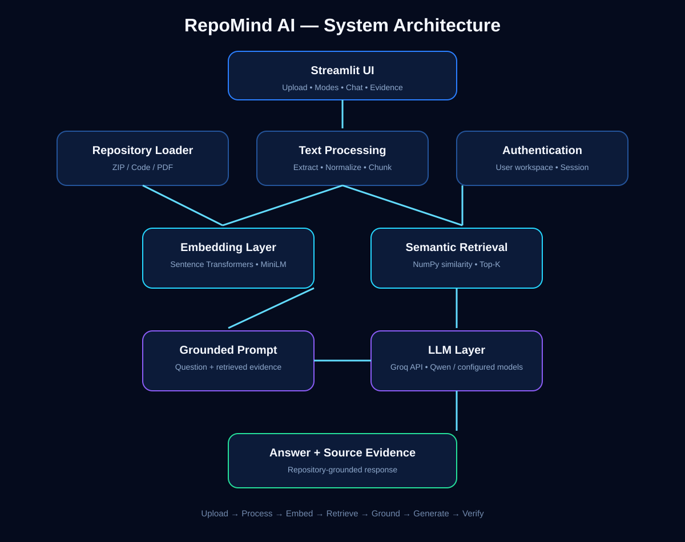

# 🧠 RepoMind AI

### RAG-Powered Codebase Intelligence Assistant

> Understand, search, explain, and diagnose codebases using Retrieval-Augmented Generation (RAG).

RepoMind AI is an AI-powered developer assistant that lets you upload a GitHub repository, source-code files, documentation, or PDFs and ask questions about the indexed content.

Instead of asking an LLM to answer only from general knowledge, RepoMind AI first retrieves the most relevant parts of the uploaded codebase and then uses an LLM to generate a grounded response with source evidence.

---

## ✨ Why RepoMind AI?

Understanding an unfamiliar codebase can take hours. Developers often need to manually search files, understand architecture, trace data flow, locate authentication logic, debug errors, and read documentation.

RepoMind AI turns this into an interactive AI-assisted workflow.

### Example

Upload:

```text
MultiGenAI/
├── app.py
├── auth.py
├── database.py
├── intent_detector.py
├── prompt_builder.py
└── README.md
```

Then ask:

> How does MultiGenAI keep one user's chat history separate from another user's history?

RepoMind AI retrieves relevant code and documentation, then generates an answer based on that evidence.

---

# 🚀 What Can RepoMind AI Do?

### 💬 Ask Repository
Ask natural-language questions about an uploaded repository.

Examples:
```text
What does this project do?
Where is authentication implemented?
How is the database connected?
How does the application process a user request?
```

### 💻 Explain Code
Understand functions, modules, classes, and implementation details.

```text
Explain the load_user_chats function.
What does this module do?
Explain this authentication flow.
```

### 🏗️ Architecture Analysis
Understand how components work together.

```text
Explain the complete architecture.
What are the main modules?
How does data flow through the application?
```

### 🐛 Debug / Diagnose
Investigate problems using retrieved codebase context.

```text
User A can see User B's chat history. What should I inspect first?
Which part of the code could cause this error?
```

---

# 🧠 Core Concept: Retrieval-Augmented Generation (RAG)

Traditional LLM:

```text
User Question
      ↓
     LLM
      ↓
   Answer
```

RepoMind AI:

```text
User Question
      ↓
Semantic Retrieval
      ↓
Relevant Repository Content
      ↓
LLM + Retrieved Context
      ↓
Grounded Answer
      ↓
Source Evidence
```

The key principle is:

> **Retrieve first, generate second.**

This allows the assistant to answer using the actual indexed repository.

---

# 🔄 Complete Workflow


```text
Upload Repository
      ↓
File Extraction
      ↓
Text Cleaning / Normalization
      ↓
Chunking
      ↓
Sentence Transformer Embeddings
      ↓
Semantic Retrieval
      ↓
Relevant Chunks
      ↓
Grounded Prompt
      ↓
Groq + Qwen
      ↓
AI Answer + Evidence
```

---

# 🏗️ System Architecture



```text
Streamlit UI
      ↓
Repository Loader
      ↓
Text Extraction & Normalization
      ↓
Text Chunker
      ↓
Sentence Transformers
      ↓
Embedding Index
      ↓
Semantic Retrieval
      ↓
Top-K Relevant Chunks
      ↓
Grounded Prompt
      ↓
Groq API + Qwen
      ↓
Answer + Source Evidence
```

---

# 🔬 RAG Pipeline Explained

## 1. Ingestion

The user uploads a repository or supported document.

RepoMind AI extracts readable content and ignores unnecessary directories such as:

```text
.git
node_modules
venv
__pycache__
dist
build
```

## 2. Text Extraction

Supported examples include:

- Python
- JavaScript / TypeScript
- Java
- C / C++
- C#
- Go
- Rust
- PHP
- Ruby
- Swift
- Kotlin
- SQL
- HTML / CSS
- JSON / YAML
- Markdown / TXT
- Shell / Batch
- Dockerfile
- PDF

## 3. Chunking

Large files are divided into smaller overlapping text chunks.

This prevents the entire repository from being sent to the LLM and allows relevant sections to be retrieved efficiently.

```text
Large file
   ↓
Chunk 1
Chunk 2
Chunk 3
Chunk 4
...
```

## 4. Embeddings

RepoMind AI uses:

```text
Sentence Transformers
Model: all-MiniLM-L6-v2
```

Each text chunk is converted into a numerical vector called an embedding.

```text
"User authentication is handled in auth.py"
                    ↓
          [0.12, -0.08, 0.41, ...]
```

## 5. Semantic Retrieval

The user question is converted into an embedding and compared against repository chunk embeddings.

```text
Question
   ↓
Query Embedding
   ↓
Compare Chunk Embeddings
   ↓
Similarity Scores
   ↓
Top-K Relevant Chunks
```

RepoMind AI uses normalized vector dot products for similarity search.

## 6. Grounded Generation

Retrieved evidence is added to a prompt together with the user's question.

```text
Repository Evidence
        +
User Question
        ↓
      LLM
        ↓
Grounded Response
```

The UI then shows the answer together with retrieved evidence.

---

# 🤖 AI / LLM Layer

RepoMind AI uses **Groq** for LLM inference.

Configured model options include:

```text
qwen/qwen3.8-27b
openai/gpt-oss-20b
openai/gpt-oss-7b
```

The LLM handles:

- Question understanding
- Evidence interpretation
- Context combination
- Natural-language answer generation

The retrieval layer handles finding relevant repository content.

---

# 🧩 Main Application Components

The current lightweight version keeps the main application logic in `app.py`.

## `app.py`

Primary application file responsible for:

- Streamlit UI
- Authentication UI
- Session management
- File upload
- ZIP extraction
- PDF extraction
- Code/document extraction
- Text normalization
- Chunking
- Embedding generation
- Semantic retrieval
- LLM interaction
- Response generation
- Evidence display
- Chat/history handling

## `requirements.txt`

Contains project dependencies such as:

```text
streamlit
numpy
pypdf
sentence-transformers
groq
python-dotenv
```

## `README.md`

Project documentation covering the project, workflow, architecture, setup, usage, and technology stack.

## `.gitignore`

Prevents sensitive/unnecessary files from being committed:

```text
.env
venv/
__pycache__/
*.pyc
```

## `data/`

Used for local application data such as the authentication database. Runtime/sensitive data should not be committed.

---

# 🛠️ Technology Stack

| Technology | Purpose |
|---|---|
| **Python** | Core programming language |
| **Streamlit** | Web application and UI |
| **Sentence Transformers** | Text embeddings |
| **all-MiniLM-L6-v2** | Embedding model |
| **NumPy** | Vector operations and similarity search |
| **Groq** | Fast LLM inference |
| **Qwen / OpenAI open-weight models** | AI response generation |
| **PyPDF** | PDF text extraction |
| **SQLite** | Local authentication/application storage |
| **python-dotenv** | Environment variable management |

---

## 📤 What You Can Upload

RepoMind AI supports multiple input formats:

- 📦 **ZIP Repository** — Upload a complete GitHub/project repository as a ZIP archive.
- 📄 **Individual Code Files** — Upload multiple source-code files directly without creating a ZIP.
- 📑 **PDF Documents** — Upload technical documentation or project-related PDFs.

Supported source files include Python, JavaScript/TypeScript, Java, C/C++, C#, Go, Rust, PHP, Ruby, Swift, Kotlin, SQL, HTML/CSS, JSON/YAML, Markdown, Shell, Batch, Dockerfile, and more.

All uploaded content is processed through the same pipeline:

**Upload → Text Extraction → Chunking → Embedding → Semantic Retrieval → Groq LLM → Grounded Answer**

# 🎯 Where Can RepoMind AI Be Used?

### 👨‍💻 Developers
Understand unfamiliar codebases faster.

### 🧑‍🎓 Students
Learn project structure and explain projects during demos or viva.

### 👥 Development Teams
Help new developers understand an existing project.

### 🐛 Debugging
Find code related to errors or unexpected behavior.

### 📚 Documentation
Ask questions about project documentation and implementation.

### 🔍 Codebase Exploration
Search a large repository using natural language instead of manually opening files.

### 🏫 Academic Projects
Demonstrate practical concepts such as RAG, embeddings, semantic search, and LLM integration.

---

# 🧪 Example Questions

```text
What does this project do?
```

```text
Explain the complete architecture of this project.
```

```text
Where is authentication implemented?
```

```text
How does the application store chat history?
```

```text
Which files are responsible for database operations?
```

```text
Explain how a user request flows through the application.
```

```text
Does this project use RAG? Show the evidence.
```

```text
User A can see User B's chat history. What should I inspect first?
```

---

# 🛡️ Grounded Answers & Evidence

RepoMind AI shows the retrieved evidence behind its answers.

```text
Question
   ↓
Top Semantic Matches
   ↓
File Name
   ↓
Relevant Source Content
   ↓
LLM Answer
```

For example, when analyzing MultiGenAI:

```text
Question:
Does MultiGenAI use external document RAG?

Retrieved:
MultiGenAI/README.md

Evidence:
"No external document RAG system is currently integrated."

Result:
RepoMind AI can answer based on repository evidence rather than guessing.
```

---

# 🔐 Authentication & User Workspace

The application includes a user authentication layer for the workspace.

```text
Register
   ↓
Login
   ↓
Authenticated Workspace
   ↓
Repository Analysis
   ↓
Chat / History
```

User-specific application data can be associated with the authenticated user.

---

# 📊 What Makes RepoMind AI Different?

### Traditional chatbot

```text
Question
   ↓
LLM
   ↓
Generic Knowledge
   ↓
Answer
```

### RepoMind AI

```text
Repository
   ↓
Index
   ↓
Semantic Retrieval
   ↓
Relevant Source Evidence
   ↓
LLM
   ↓
Repository-Grounded Answer
```

It is designed around the **actual codebase being analyzed**.

---

# 💡 Key Concepts Learned

Building RepoMind AI demonstrates practical understanding of:

- Retrieval-Augmented Generation
- Semantic Search
- Text Embeddings
- Vector Similarity
- Chunking
- Context Retrieval
- Prompt Engineering
- Grounded Generation
- LLM APIs
- Repository Parsing
- PDF Text Extraction
- Streamlit Application Development
- Session State
- Authentication
- Local Data Storage
- AI-assisted Software Engineering

---

# 📈 Current Limitations

The current version is intentionally lightweight.

- Embeddings are kept in application memory.
- Vector search uses NumPy instead of a dedicated vector database.
- Very large repositories may require optimization.
- Retrieval quality depends on chunking and embedding quality.
- LLM responses depend on the selected model and API limits.
- Code understanding is based on retrieved textual context rather than full program execution.

---

# 🚀 Future Improvements

Possible future versions:

- GitHub URL ingestion
- Automatic repository cloning
- Persistent vector database
- FAISS / Chroma / Qdrant
- Code-aware chunking
- AST-based code analysis
- Multi-repository workspaces
- Dependency graph visualization
- Automatic architecture diagrams
- Advanced debugging
- Code change suggestions
- Pull-request analysis
- Repository comparison
- Long-term project memory

---

# ⚙️ Installation

## 1. Clone

```bash
git clone https://github.com/DasSubham-2005/RepoMind-AI.git
cd RepoMind-AI
```

## 2. Virtual Environment

### Windows

```powershell
python -m venv venv
venv\Scripts\activate
```

### macOS / Linux

```bash
python3 -m venv venv
source venv/bin/activate
```

## 3. Install Dependencies

```bash
pip install -r requirements.txt
```

## 4. Configure Groq API Key

Create `.env`:

```env
GROQ_API_KEY=your_groq_api_key
```

Never commit `.env` to GitHub.

## 5. Run

```bash
streamlit run app.py
```

---

# 🖥️ Usage

1. Open RepoMind AI.
2. Register or log in.
3. Upload a repository ZIP, code/document files, or supported PDF.
4. Build the repository index.
5. Choose an analysis mode:
   - Ask Repository
   - Explain Code
   - Architecture
   - Debug / Diagnose
6. Ask a question.
7. Review the AI answer and retrieved evidence.

---

# 🏆 Project Highlights

```text
🧠 RAG-Powered Codebase Assistant
🔎 Semantic Repository Search
💻 Code Explanation
🏗️ Architecture Analysis
🐛 Debug / Diagnose Mode
📄 PDF & Code Ingestion
🤖 Groq + Qwen LLM
🔢 Sentence Transformer Embeddings
📚 Evidence-Based Answers
🔐 User Authentication
🌑 Premium Dark UI
⚡ Streamlit Web Application
```

---

# 👨‍💻 Creator

**Subham Das**

**AI/ML Engineer | Data Scientist | Data Analyst**

- GitHub: https://github.com/DasSubham-2005
- LinkedIn: https://www.linkedin.com/in/subham-das-a316422b/

---

# ⭐ Project Summary

> **RepoMind AI is a RAG-powered codebase intelligence assistant that combines semantic retrieval, Sentence Transformer embeddings, and Groq-hosted LLMs to help developers understand, search, explain, and diagnose software repositories using grounded source evidence.**

---

## 📜 License

This project is intended for educational, portfolio, and demonstration purposes.
