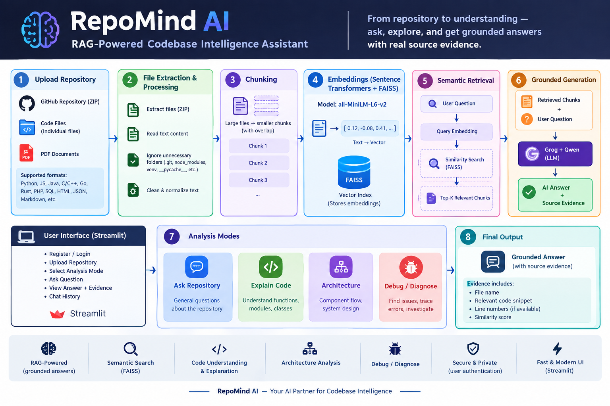
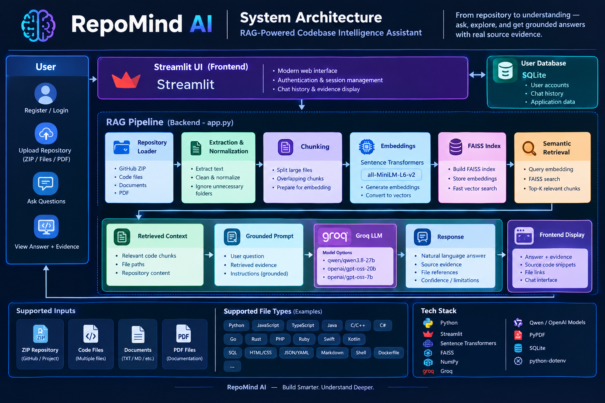

# 🧠 RepoMind AI

### RAG-Powered Codebase Intelligence Assistant

> Understand, search, explain, and diagnose software repositories using Retrieval-Augmented Generation (RAG).

RepoMind AI is an AI-powered developer assistant that lets users upload a GitHub repository, source-code files, documentation, or PDFs and ask natural-language questions about the indexed content.

Instead of relying only on an LLM's general knowledge, RepoMind AI first retrieves relevant content from the uploaded repository and then generates a grounded response using that retrieved evidence.

---

## 🚀 Project Showcase

### 🔄 RepoMind AI Workflow



```text
Upload Repository / Files
          ↓
     File Extraction
          ↓
   Text Normalization
          ↓
       Chunking
          ↓
Sentence Transformer
    Embeddings
          ↓
      FAISS Index
          ↓
 Semantic Retrieval
          ↓
 Relevant Evidence
          ↓
   Grounded Prompt
          ↓
      Groq LLM
          ↓
   AI Answer + Evidence
```

---

# ✨ Why RepoMind AI?

Understanding an unfamiliar codebase can take hours.

Developers and students often need to:

- Search through multiple files
- Understand unfamiliar functions
- Trace authentication logic
- Understand database operations
- Analyze project architecture
- Find relevant code for debugging
- Read project documentation

RepoMind AI turns this into an interactive AI-assisted workflow.

### Example

Upload a project:

```text
MultiGenAI/
├── app.py
├── auth.py
├── database.py
├── intent_detector.py
├── prompt_builder.py
└── README.md
```

Then ask:

> How does MultiGenAI keep one user's chat history separate from another user's history?

RepoMind AI retrieves relevant source code and documentation before generating the answer.

---

# 🚀 What Can RepoMind AI Do?

## 💬 Ask Repository

Ask natural-language questions about an uploaded repository.

```text
What does this project do?
Where is authentication implemented?
How is the database connected?
How does the application process a user request?
```

## 💻 Explain Code

Understand functions, modules, classes, and implementation details.

```text
Explain the get_connection function.
What does this module do?
Explain the authentication flow.
How is chat history loaded?
```

## 🏗️ Architecture

Understand the architecture and relationships between major components.

```text
What components are used in this project?
Explain the overall architecture.
How do the major components interact?
How does data flow through the application?
```

## 🐛 Debug / Diagnose

Investigate potential problems using retrieved repository context.

```text
Which part of the code could cause this issue?
What should I inspect first?
How can this authentication issue be diagnosed?
```

The assistant is instructed to ground its response in retrieved repository evidence.

---

# 🧠 Core Concept — Retrieval-Augmented Generation

A traditional LLM workflow looks like:

```text
User Question
      ↓
     LLM
      ↓
   Answer
```

RepoMind AI uses a retrieval-first approach:

```text
User Question
      ↓
Query Embedding
      ↓
FAISS Semantic Search
      ↓
Relevant Repository Chunks
      ↓
Grounded Prompt
      ↓
Groq LLM
      ↓
Grounded Answer
      ↓
Retrieved Evidence
```

### Core principle

> **Retrieve first, generate second.**

---

# 🏗️ System Architecture



```text
              Streamlit UI
                   ↓
          Repository / File Loader
                   ↓
       Text Extraction & Normalization
                   ↓
                Chunking
                   ↓
       Sentence Transformer Model
                   ↓
              Embeddings
                   ↓
              FAISS Index
                   ↓
          Semantic Retrieval
                   ↓
          Top-K Relevant Chunks
                   ↓
           Grounded Prompt
                   ↓
              Groq API
                   ↓
             Selected LLM
                   ↓
          Answer + Evidence
```

---

# 🔄 Complete RAG Workflow

## 1. Upload

The user uploads one or more supported sources.

Supported inputs include:

- ZIP repositories
- Individual source-code files
- Documentation files
- PDF documents

## 2. File Extraction

For ZIP repositories, RepoMind AI extracts readable project files while ignoring unnecessary directories such as:

```text
.git
node_modules
venv
__pycache__
dist
build
```

## 3. Text Extraction

RepoMind AI extracts readable text from supported source files and documents.

Examples include:

```text
Python
JavaScript
TypeScript
Java
C
C++
C#
Go
Rust
PHP
Ruby
Swift
Kotlin
SQL
HTML
CSS
JSON
YAML
Markdown
TXT
Shell
Batch
Dockerfile
PDF
```

## 4. Text Normalization

Extracted content is cleaned and normalized before being processed further.

## 5. Chunking

Large files are divided into smaller overlapping text chunks.

```text
Large File
    ↓
 ┌─────────┐
 │ Chunk 1 │
 ├─────────┤
 │ Chunk 2 │
 ├─────────┤
 │ Chunk 3 │
 ├─────────┤
 │ Chunk 4 │
 └─────────┘
```

## 6. Embedding Generation

RepoMind AI uses Sentence Transformers.

```text
Model: all-MiniLM-L6-v2
```

Each text chunk is converted into a numerical embedding vector.

## 7. FAISS Vector Search

RepoMind AI uses **FAISS** for vector similarity search.

```text
User Question
      ↓
Query Embedding
      ↓
FAISS Search
      ↓
Similarity Scores
      ↓
Top-K Relevant Chunks
```

The application uses normalized embeddings and similarity search to retrieve relevant repository content.

## 8. Grounded Generation

Retrieved evidence is added to the LLM prompt.

```text
Retrieved Repository Evidence
              +
        User Question
              ↓
       Grounded Prompt
              ↓
           Groq LLM
              ↓
        AI Generated Answer
```

The UI shows the generated answer together with retrieved evidence.

---

# 🤖 AI / LLM Layer

RepoMind AI uses **Groq** for LLM inference.

Configured model options include:

```text
qwen/qwen3.8-27b
openai/gpt-oss-20b
openai/gpt-oss-7b
```

The LLM interprets retrieved evidence and generates a natural-language response.

The retrieval layer finds relevant repository content.

---

# 🧩 Application Components

The current lightweight implementation keeps the main application logic in:

```text
app.py
```

### `app.py`

Responsible for:

- Streamlit UI
- Authentication interface
- Session management
- File upload
- ZIP extraction
- PDF extraction
- Source-code extraction
- Text normalization
- Text chunking
- Embedding generation
- FAISS indexing
- Semantic retrieval
- LLM interaction
- Response generation
- Evidence display
- Chat/history handling

### `requirements.txt`

Contains project dependencies including:

```text
streamlit
numpy
sentence-transformers
faiss-cpu
groq
pypdf
python-dotenv
```

### `.gitignore`

Prevents sensitive or unnecessary files from being committed:

```text
.env
venv/
__pycache__/
*.pyc
*.db
```

### `data/`

Used for local application data. Runtime or sensitive data should not be committed.

---

# 📁 Project Structure

```text
RepoMind-AI/
│
├── app.py
├── requirements.txt
├── README.md
├── run.bat
├── .gitignore
│
├── data/
│   └── .gitkeep
│
└── docs/
    ├── repomind-workflow.svg
    └── repomind-architecture.svg
```

---

# 🛠️ Technology Stack

| Technology | Purpose |
|---|---|
| **Python** | Core programming language |
| **Streamlit** | Web application and UI |
| **Sentence Transformers** | Semantic text embeddings |
| **all-MiniLM-L6-v2** | Embedding model |
| **FAISS** | Vector similarity search |
| **NumPy** | Numerical array operations |
| **Groq** | LLM inference |
| **Qwen / OpenAI open-weight models** | AI response generation |
| **PyPDF** | PDF text extraction |
| **SQLite** | Local application/authentication storage |
| **python-dotenv** | Environment variable management |

---

# 📤 Supported Uploads

RepoMind AI supports:

- 📦 ZIP repositories
- 📄 Individual source-code files
- 📑 PDF documents

All supported content follows:

```text
Upload
  ↓
Extraction
  ↓
Normalization
  ↓
Chunking
  ↓
Embeddings
  ↓
FAISS Index
  ↓
Semantic Retrieval
  ↓
Groq LLM
  ↓
Grounded Answer
```

---

# 🛡️ Grounded Answers & Evidence

RepoMind AI provides visibility into the retrieved context behind an answer.

```text
Question
    ↓
Semantic Retrieval
    ↓
Top Relevant Matches
    ↓
File / Source Path
    ↓
Retrieved Content
    ↓
Grounded LLM Answer
```

If the indexed repository does not contain enough evidence, RepoMind AI can respond:

```text
I couldn't find enough evidence in the indexed repository.
```

This helps prevent answers based on unrelated information.

---

# 🔐 Authentication & User Workspace

The application includes an authentication layer for the workspace.

General flow:

```text
Register
   ↓
Login
   ↓
Authenticated Workspace
   ↓
Repository Analysis
   ↓
Chat / History
```

User-specific application data can be associated with the authenticated user.

---

# 🎛️ Analysis Modes

RepoMind AI currently provides four analysis modes:

```text
Ask Repository
Repository Q&A

Explain Code
Code Understanding

Architecture
System Understanding

Debug / Diagnose
Problem Investigation
```

---

# 👨‍💻 Use Cases

### Developers
Understand unfamiliar codebases using natural-language questions.

### 🧑‍🎓 Students
Learn project structure and prepare for project demonstrations and viva.

### 👥 Development Teams
Help developers understand an existing project faster.

### 🐛 Debugging
Locate relevant code and repository context when investigating problems.

### 📚 Documentation
Ask questions about project documentation and implementation.

### 🔍 Codebase Exploration
Search large repositories using natural language.

### 🏫 Academic Projects
Demonstrate practical concepts such as RAG, embeddings, semantic search, FAISS, and LLM APIs.

---

# 🧪 Example Questions

```text
What does this project do?
Where is authentication implemented?
Explain the get_connection function.
How does the application store chat history?
Which files are responsible for database operations?
Explain the overall architecture.
How does a user request flow through the application?
Does this project use external document RAG?
What could cause one user to see another user's chat history?
```

---

# 💡 Key Concepts Learned

Building RepoMind AI demonstrates practical understanding of:

- Retrieval-Augmented Generation
- Semantic Search
- Text Embeddings
- Vector Similarity
- FAISS
- Chunking
- Context Retrieval
- Prompt Engineering
- Grounded Generation
- LLM APIs
- Repository Parsing
- PDF Text Extraction
- Streamlit
- Session State
- Authentication
- Local Data Storage
- AI-assisted Software Engineering

---

# 📈 Current Limitations

The current version is intentionally lightweight.

- Embeddings and the FAISS index are kept in application memory.
- Very large repositories may require further optimization.
- Retrieval quality depends on chunking and embedding quality.
- LLM responses depend on the selected model and API limits.
- Code understanding is based on retrieved textual context rather than full program execution.
- The current implementation does not execute uploaded repository code.

---

# 🚀 Future Improvements

Possible future improvements include:

- GitHub URL ingestion
- Automatic repository cloning
- Persistent vector databases such as Chroma or Qdrant
- Code-aware chunking
- AST-based code analysis
- Multi-repository workspaces
- Dependency graph visualization
- Automatic architecture diagrams
- Advanced debugging
- Code change suggestions
- Pull-request analysis
- Repository comparison
- Long-term project memory

---

# ⚙️ Installation

## 1. Clone the Repository

```bash
git clone https://github.com/DasSubham-2005/RepoMind-AI.git
cd RepoMind-AI
```

## 2. Create a Virtual Environment

### Windows

```powershell
python -m venv venv
venv\Scriptsctivate
```

### macOS / Linux

```bash
python3 -m venv venv
source venv/bin/activate
```

## 3. Install Dependencies

```bash
pip install -r requirements.txt
```

## 4. Configure Groq API Key

Create a `.env` file in the project root:

```env
GROQ_API_KEY=your_groq_api_key
```

Never commit `.env` to GitHub.

## 5. Run the Application

```bash
streamlit run app.py
```

Or on Windows:

```text
run.bat
```

---

# 🖥️ Usage

1. Open RepoMind AI.
2. Register or log in.
3. Upload a repository ZIP, source files, or supported PDF.
4. Click **Build RAG Index**.
5. Wait until indexing is completed.
6. Select an analysis mode.
7. Ask your question.
8. Review the grounded answer.
9. Expand **View Evidence** to inspect retrieved source content.

### Important

The RAG index only needs to be built again when the uploaded repository or source content changes.

Changing the analysis mode does **not** require rebuilding the index.

---

# 🧠 RAG Indexing Process

```text
             Upload
                ↓
          File Extraction
                ↓
           Text Cleaning
                ↓
             Chunking
                ↓
       Sentence Transformer
                ↓
           Embeddings
                ↓
          FAISS Index
                ↓
          Ready for Q&A
```

Once the index is built, the same indexed repository can be used across the available analysis modes.

---

# 📊 Project Highlights

```text
🧠 RAG-Powered Codebase Assistant
🔎 Semantic Repository Search
⚡ FAISS Vector Search
💻 Code Explanation
🏗️ Architecture Analysis
🐛 Debug / Diagnose Mode
📄 PDF & Code Ingestion
🤖 Groq + Qwen LLM
🔢 Sentence Transformer Embeddings
📚 Evidence-Based Answers
🛡️ Grounded Generation
🔐 User Authentication
🌑 Premium Dark UI
⚡ Streamlit Web Application
```

---

# 🏆 What Makes RepoMind AI Different?

### Traditional LLM

```text
Question
   ↓
LLM
   ↓
General Knowledge
   ↓
Answer
```

### RepoMind AI

```text
Repository
   ↓
Index
   ↓
Semantic Retrieval
   ↓
Relevant Source Evidence
   ↓
Grounded Prompt
   ↓
LLM
   ↓
Repository-Grounded Answer
```

The key difference is that RepoMind AI is designed to answer questions using the **repository being analyzed** as its primary evidence source.

---

### Application

The application provides a premium dark-themed interface with:

- Repository upload
- RAG index building
- Analysis mode selection
- AI chat interface
- Retrieved evidence
- Indexed file information
- User authentication
- Chat history

---

# 👨‍💻 Creator

## Subham Das

**AI/ML Engineer | Data Scientist | Data Analyst**

- GitHub: https://github.com/DasSubham-2005
- LinkedIn: https://www.linkedin.com/in/subham-das-a316422b/

---

# ⭐ Project Summary

> **RepoMind AI is a RAG-powered codebase intelligence assistant that combines Sentence Transformer embeddings, FAISS vector search, and Groq-hosted LLMs to help developers understand, search, explain, and diagnose software repositories using grounded source evidence.**

---

## 📜 License

This project is intended for educational, portfolio, and demonstration purposes.
